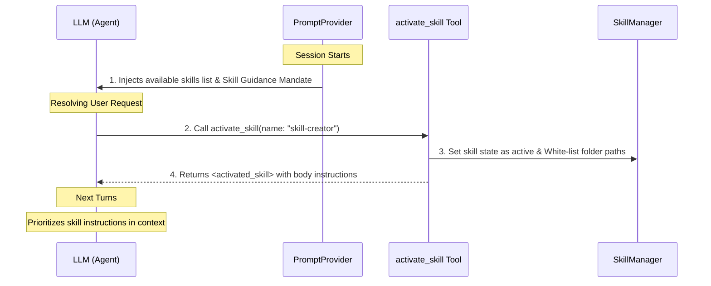

# Reference: Gemini CLI Agent Skills Implementation

This document serves as an architectural reference for Domour, detailing how **Agent Skills** are designed, discovered, and dynamically injected into the model's context in `gemini-cli`.

---

## 1. Skill Concept & File Format
In `gemini-cli`, a skill is a directory containing a **`SKILL.md`** file, optionally accompanied by scripts, resources, examples, and rules.

The `SKILL.md` uses **YAML Frontmatter** for metadata and a Markdown body for instructions:

```markdown
---
name: skill-creator
description: Helper skill to initialize, validate, and package custom agent skills
---

# Instructions
You are an expert at creating agent skills. Follow these steps:
1. Initialize the directory structure using the init script.
2. Draft the SKILL.md file with accurate frontmatter.
...
```

### Key Elements:
*   **Metadata**: `name` and `description` are defined in the frontmatter and used for discovery and listing.
*   **Body**: The remainder of the markdown body acts as the execution guide/instructions for the model when the skill is active.

---

## 2. Loader & Discovery (`skillLoader.ts`)
Discovered skills are cataloged in precedence order:
1.  **Built-in Skills** (Lowest precedence)
2.  **Extension Skills** (Discovered from active plugins)
3.  **User-level Skills** (Loaded from `~/.gemini/skills/` or `~/.agents/skills/`)
4.  **Workspace/Project Skills** (Highest precedence, loaded from `.gemini/skills/` or `.agents/skills/` inside the workspace)

### Loader Rules:
*   Uses a glob pattern search `['SKILL.md', '*/SKILL.md']` to find files.
*   Extracts frontmatter using regex: `/^---\r?\n([\s\S]*?)\r?\n---(?:\r?\n([\s\S]*))?/`.
*   Sanitizes skill names for directory naming safety.
*   Excludes folders like `node_modules` and `.git`.

---

## 3. Context Injection Flow
Skills are not loaded into the agent's context all at once. Instead, they are advertised, guided by rules, and dynamically loaded via tool calls.



### Step 1: Initial Advertisement (System Prompt)
During system prompt construction, the list of available skills is appended to the system prompt in a structured XML format:

```xml
# Available Agent Skills
You have access to the following specialized skills. To activate a skill and receive its detailed instructions, call the activate_skill tool with the skill's name.

<available_skills>
  <skill>
    <name>skill-creator</name>
    <description>Helper skill to initialize, validate, and package custom agent skills</description>
    <location>/home/user/workspace/.agents/skills/skill-creator/SKILL.md</location>
  </skill>
</available_skills>
```

### Step 2: Skill Guidance Mandate (Core Mandates)
To ensure the model respects the skill instructions, the system prompt includes a mandate:
> **Skill Guidance**: Once a skill is activated via `activate_skill`, its instructions and resources are returned wrapped in `<activated_skill>` tags. You MUST treat the content within `<instructions>` as expert procedural guidance, prioritizing these specialized rules and workflows over your general defaults...

### Step 3: Dynamic Tool Activation
The model calls the tool `activate_skill(name: "skill-creator")` when it encounters a matching task. The tool execution does two things:
1.  Registers the skill as active in the session config.
2.  Adds the skill's directory to the allowed workspace paths so the agent is granted read permissions to sub-resources (like `./scripts` or `./examples` in the skill's directory).

### Step 4: XML Tool Result Return
The tool returns the skill instructions and resources structured in XML back as the tool call result (`llmContent`):

```xml
<activated_skill name="skill-creator">
  <instructions>
    You are an expert at creating agent skills. Follow these steps:
    1. Initialize the directory structure...
  </instructions>
  <available_resources>
    .agents/skills/skill-creator/scripts/init_skill.cjs
    .agents/skills/skill-creator/scripts/validate_skill.cjs
  </available_resources>
</activated_skill>
```

Since this XML is returned from the tool call, it enters the LLM's chat history, instantly making its instructions active for all subsequent reasoning turns.

---

## 4. Architectural Implications for Domour
Domour leverages this blueprint for standard skills support as follows:
*   **YAML Frontmatter & Body Parsing**: Handled in `internal/bionic/skill/parser.go` with fallbacks for legacy title structures.
*   **Directory Naming Context**: Using parent folder names instead of raw filenames to support standard folder-based skills (e.g. `skills/k8s-pod/SKILL.md` -> `domour:k8s-pod`).
*   **Dapr-State Store Extension**: Storing skills in a cluster-wide `DaprRegistry` so multiple agent nodes can share and dynamically synthesize skills under `cosmos-star`.
